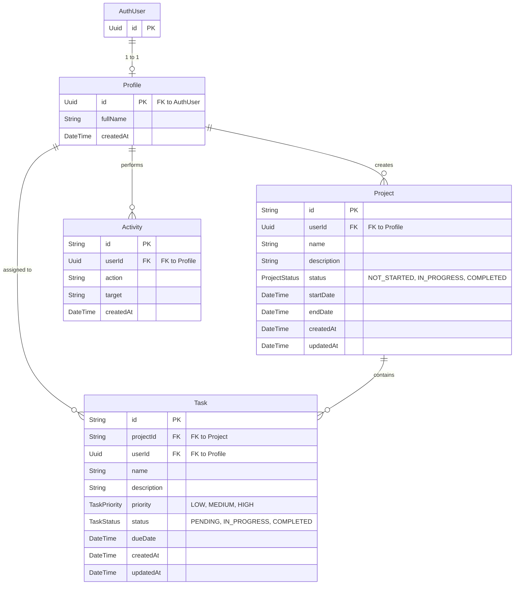

# ISMO - Project Management Platform

ISMO is a full-stack project management platform built to help engineers and teams organize their tasks, track project progress, and manage activities with a premium, modern user interface.

## Tech Stack

- **Frontend**: React 18, Vite, TypeScript, TailwindCSS (Custom Glassmorphism Design), Lucide React (Icons), React Hook Form + Zod (Validation), React Router.
- **Backend**: Node.js, Express, TypeScript, Zod (Validation).
- **Database**: PostgreSQL (managed via Supabase).
- **ORM**: Prisma.
- **Authentication**: Supabase Auth (JWT, Row Level Security compatible).
- **Containerization**: Docker & Docker Compose.

---

## Live Demo & Evaluation Guide

**Live Application URL**: [https://ismo-sepia.vercel.app](https://ismo-sepia.vercel.app)

To evaluate the application, you can either create your own account or use the pre-configured demo account below to explore the dashboard, manage projects, and track tasks.

### Demo Account
- **Email**: `demo@ismo.com`
- **Password**: `demo1234`

### Recommended Testing Flow
1. **Sign In**: Use the demo account or create a new one via the Sign Up page.
2. **Dashboard**: View the summary statistics and recent activity feeds.
3. **Projects**: Navigate to the Projects page to create a new project with a start and end date.
4. **Tasks**: Inside a project, create tasks, assign them priorities (Low, Medium, High), and update their status (Pending, In Progress, Completed).
5. **Activity Tracking**: Notice how actions like creating projects or updating tasks are automatically logged in the Activity feed.

---

## Database Schema & ER Diagram

The database uses PostgreSQL and is managed entirely through Prisma. The schema includes users, profiles, projects, tasks, and activity logs.

---

## API Documentation

The backend exposes a RESTful API running on `/api`. All protected routes require a `Bearer <token>` in the `Authorization` header.

### Authentication (`/api/auth`)
| Method | Endpoint | Description | Body | Auth Required |
|--------|----------|-------------|------|---------------|
| POST | `/register` | Register a new user | `{ email, password, fullName }` | No |
| POST | `/login` | Log in an existing user | `{ email, password }` | No |
| POST | `/logout` | Invalidate user session | None | Yes |
| POST | `/forgot-password` | Send password recovery email | `{ email }` | No |
| POST | `/reset-password` | Set new password with recovery token | `{ password }` | Yes (Recovery Token) |

### Projects (`/api/projects`)
| Method | Endpoint | Description | Auth Required |
|--------|----------|-------------|---------------|
| GET | `/` | Get all projects for the authenticated user | Yes |
| GET | `/:id` | Get a specific project by ID | Yes |
| POST | `/` | Create a new project | Yes |
| PUT | `/:id` | Update project details | Yes |
| DELETE | `/:id` | Delete a project | Yes |

### Tasks (`/api/tasks`)
| Method | Endpoint | Description | Auth Required |
|--------|----------|-------------|---------------|
| GET | `/` | Get all tasks for the user | Yes |
| GET | `/:projectId` | Get tasks for a specific project | Yes |
| POST | `/` | Create a new task | Yes |
| PUT | `/:id` | Update task details / status | Yes |
| DELETE | `/:id` | Delete a task | Yes |

### Dashboard & Analytics (`/api/dashboard`)
| Method | Endpoint | Description | Auth Required |
|--------|----------|-------------|---------------|
| GET | `/stats` | Get aggregate statistics (completion rates, task counts) | Yes |
| GET | `/activity` | Get recent activity logs for the user | Yes |

---

